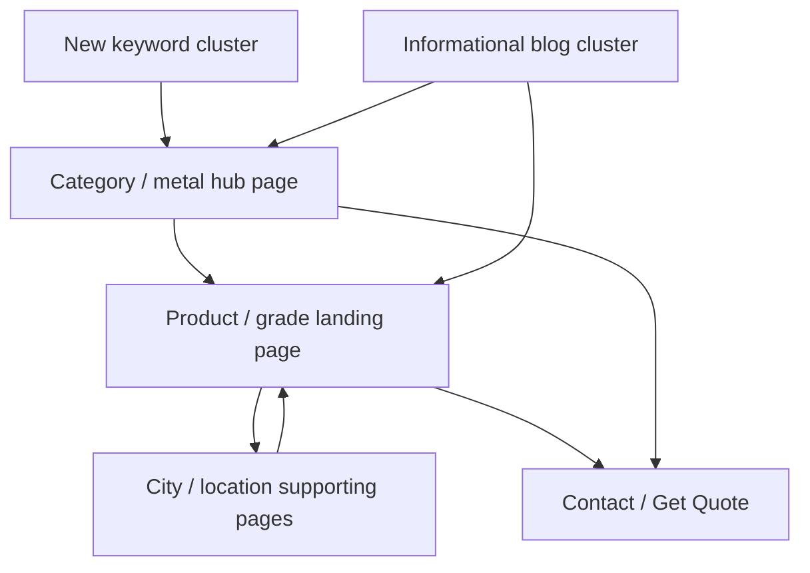

# Design Document: SEO Keyword Migration

## Overview

This feature re-optimizes the **existing production website** at `creativemetalind.com` (a SolidStart / SolidJS + Vinxi app in `creative-metal-industries/`) around a **new authoritative keyword list** covering mild steel, carbon steel, alloy/chrome-moly steel, stainless steel, duplex/super duplex, Inconel, Hastelloy, Monel, titanium, and A36. The goal is to make Google associate the site's pages with the new primary commercial and informational topics by improving on-page targeting, topical clustering, internal linking, structured data, canonical handling, and indexability.

This is a **content/SEO-architecture project only**. The website's **visual design and appearance must not change** — no changes to colors, fonts, header/footer look, UI style, animations, layout, or product images — except where an SEO/content change absolutely requires it (e.g., editing an `alt` attribute, or adding a text section already consistent with the existing style). All edits happen inside the SEO/content surfaces of each route: `<Title>`, `<Meta name="description">`, `<Link rel="canonical">`, OG/Twitter meta, the single H1, H2/H3 headings, body copy, FAQ content, inline JSON-LD, internal links / anchor text, the sitemap, and indexability signals.

Three realities frame the whole effort. First, the site already has ~594 pages (product/spec landing pages, many city location pages, and a 300+ file blog directory plus a dynamic `blog/[slug].tsx` with an `ARTICLES` map). We **reuse and optimize existing matching pages** rather than mass-generating new ones. Second, Google Search Console **does not allow keywords to be added manually**, and **rankings cannot be guaranteed** — we can only make pages genuinely worthy of ranking. Third, everything must be **reversible and technically clean**: git checkpoints before edits, a changelog of prior values, and a successful `npm run build` plus sitemap verification after changes.

### Goals

- Re-target site pages to the new authoritative keyword clusters.
- Preserve the existing visual design/appearance exactly.
- Improve indexability of important pages (uniqueness, internal links, sitemap presence, correct canonical, crawl accessibility).
- Eliminate keyword cannibalization by enforcing one primary URL per primary keyword.
- Produce auditable deliverable reports and a reversible changelog.

### Non-Goals

- No website redesign or visual/appearance change.
- No blind update of all ~594 pages; no keyword stuffing; no page-per-tiny-variation; no `<meta name="keywords">` tag.
- No invented business/product/spec/certification/stock/price/review/location data.
- No deletion of valuable pages without evidence.
- No promises of rankings; no claim that GSC keywords can be edited manually.
- Do not delete natural supporting terminology that is absent from the new list; only stop *intentionally* optimizing OLD unrelated target keywords where they conflict with the new strategy.

---

# PART 1 — HIGH-LEVEL DESIGN

## 1. Keyword Cluster Architecture

The new keyword list is organized into **topical clusters**. Each cluster maps to **exactly one primary target URL** (the strongest existing matching page). Variants (e.g., `304 pipe`, `304l pipe`, `ss 304 pipe supplier`) are consolidated onto the same primary page rather than spawning new pages. City/location variants of a keyword remain supporting pages that link up to the primary cluster page.

### 1.1 Cluster → Primary URL Mapping (target)

Primary URLs below are the intended canonical target per cluster. Exact existing route filenames are confirmed during the audit; where an ideal match does not exist, the "reuse vs create" criterion in Section 2 governs whether to create one.

| Cluster | Representative keywords (variants clustered) | Intended primary URL (reuse existing where present) |
|---|---|---|
| Mild Steel | mild steel, ms plate, ms angle, ms channel, ms beam, ms flat bar (+ supplier) | `/ms-plate-supplier-india` (hub) + section anchors for angle/channel/beam/flat |
| Carbon Steel Pipe | carbon steel pipe, astm a106 / a106 pipe, api 5l pipe, erw pipe, seamless pipe | `/carbon-steel-pipe-fittings-*` / dedicated CS pipe page |
| Carbon Steel Plate | carbon steel plate, sa516 grade 70 plate | `/carbon-steel-sa516-plate-stockist-india` |
| Alloy / Chrome-Moly | alloy steel pipe, chrome moly pipe, astm a335 p11/p22/p91 | `/p11-alloy-steel-pipe-supplier` + `/alloy-steel-pipe-supplier-india` |
| Stainless Steel | ss 304/316/321/310/410/430/904l pipe/plate/sheet | `/ss-304-316l-pipe-supplier-india` + grade sections |
| Duplex / Super Duplex | duplex 2205, 2205 pipe, super duplex 2507, 2507 pipe | `/duplex-steel-supplier-*` |
| Inconel / Incoloy | inconel 600/625/718, incoloy 800/825 | `/inconel-pipe-supplier-india` |
| Hastelloy | hastelloy c276, c22 | Hastelloy supplier page |
| Monel | monel 400, monel k500 | Monel supplier page |
| Titanium | titanium grade 2, grade 5, ti-6al-4v, titanium bar | `/titanium-grade-2-pipe-india` |
| A36 / A516 | a36 steel, a36 steel plate, astm a36, a516 steel plate | A36 plate page (may overlap SA516 plate cluster) |

### 1.2 Topical Flow



Each cluster forms a hub-and-spoke: the primary commercial page is the hub; grade sub-topics, city location pages, and informational blogs are spokes that link **up** to the hub using varied, natural anchor text. The hub and every spoke routes conversions to Contact / Get Quote.

## 2. Content Architecture Strategy

For every existing page in a cluster, choose one action:

- **Reuse (no change):** page already targets the cluster well and needs no change.
- **Optimize:** update Title / description / H1 / headings / body / FAQ / JSON-LD / internal links to align with the new primary keyword — no new page.
- **Expand:** add depth (a genuine H2/H3 section, FAQ entries, technical detail) to a thin-but-valuable page, keeping the existing visual style.
- **Create-new:** only when justified by the criterion below.

### 2.1 When a NEW page is justified

Create a new page **only if all** hold:

1. **Distinct search intent** not already served by an existing page (a real, separable query cluster).
2. **Business value** — the intent maps to a product/service CMI genuinely offers (no invented offerings).
3. **No cannibalization** — it will not compete with an existing primary URL for the same primary keyword.
4. **Sufficient unique content** — enough real, non-fabricated detail to be a quality, indexable page (not thin/duplicate).

If any fails, **optimize or expand an existing page instead**.

### 2.2 Guardrails against low-value page sprawl

- One primary URL per primary keyword; variants cluster onto it via headings/body, not new URLs.
- No page-per-tiny-variation (e.g., no separate URL for each schedule or each near-duplicate synonym).
- New location pages only where a genuine, differentiated local intent + supportable content exists.
- Every new page must pass the thin-content and uniqueness checks in the technical checklist (Part 2, Section 6).

## 3. Cannibalization Control

Enforce **one primary URL per primary keyword**. Supporting/related pages link to the primary and are de-optimized for that exact keyword (kept for their own supporting terms). Per conflicting page, choose an action:

- **Keep** as the primary URL for the keyword.
- **Merge** duplicate/near-duplicate content into the primary, then redirect.
- **Redirect** an obsolete duplicate to the primary (301, at the hosting/routing layer).
- **De-optimize** — remove the competing primary keyword from Title/H1 of the non-primary page, keep it as supporting.
- **Change internal links** — point internal anchors for the keyword to the primary URL.
- **Change primary keyword** — retarget a page to an adjacent, non-conflicting keyword it can own.
- **Keep as supporting** — retain the page, linking up to the primary with contextual anchors.

All decisions and actions are recorded in `KEYWORD_CANNIBALIZATION_REPORT.md`.

## 4. Blog-to-Commercial Internal Linking Strategy

The 300+ blog pages (and dynamic `blog/[slug].tsx` articles) are organized into topical clusters that support commercial hubs:

- Each blog links to its cluster's **primary commercial page** with contextual, in-body links plus `RelatedPages`.
- **Anchor text is varied and natural** (e.g., "Inconel 625 pipe supplier", "our Inconel pipe range", "nickel alloy pipes") — no repeating the same exact-match anchor across many posts.
- Avoid over-linking; typically 1–3 contextual commercial links per article where genuinely relevant, plus the existing related-pages block.
- Blogs cross-link to sibling blogs in the same cluster to build topical depth.

## 5. Indexability Strategy

Make important pages **worthy of indexing**, then remove obstacles:

- **Uniqueness:** distinct Title, description, H1, and body per page (dedupe via the technical checklist).
- **Internal links:** every important page is reachable and linked from relevant hubs/blogs (no orphans).
- **Sitemap presence:** page is emitted by `generate-sitemap.mjs` into the correct child sitemap and referenced from `sitemap-index.xml`.
- **Correct canonical:** self-referential canonical on primary pages; supporting duplicates canonicalize appropriately.
- **Crawl accessibility:** no accidental `noindex`; reachable via internal links and sitemap; not blocked in `robots.txt`.

### 5.1 Investigating GSC index states

- **Discovered – currently not indexed:** usually low value/thin or weak internal linking → expand content and add internal links from hubs.
- **Crawled – currently not indexed:** quality/uniqueness/duplication signal → improve uniqueness and internal support.
- **Excluded by `noindex`:** verify no accidental `<Meta name="robots" content="noindex">`; fix if unintended.
- **Duplicate / canonical-excluded:** confirm canonical points to the intended primary; resolve near-duplicate clusters via merge/redirect.

> **Explicit constraint:** GSC keywords cannot be added manually, and rankings cannot be guaranteed. This design only makes pages genuinely worthy of ranking and easy to crawl/index.

## 6. Deliverable Reports

All reports are markdown at the workspace root (alongside the existing `SEO_KEYWORD_PAGE_MAPPING.md`, `ALL_KEYWORDS.txt`, `MASTER_KEYWORDS_LIST_590_PAGES.txt`):

| Report | Purpose |
|---|---|
| `SEO_NEW_KEYWORD_MIGRATION_AUDIT.md` | Current-state audit: page inventory, current targeting, gaps, cannibalization risks. |
| `NEW_KEYWORD_URL_MAP.md` | New keyword cluster → primary URL mapping + supporting pages. |
| `KEYWORD_CANNIBALIZATION_REPORT.md` | Conflicts found + chosen action per page (keep/merge/redirect/de-optimize/relink/retarget/support). |
| `SEO_KEYWORD_MIGRATION_CHANGELOG.md` | Per-page before/after record for reversibility. |
| `GSC_NEW_KEYWORD_TRACKING_PLAN.md` | How to monitor clusters in GSC (queries/pages/impressions), with the manual-keyword and no-ranking-guarantee caveats. |
| `SEO_NEW_KEYWORD_IMPLEMENTATION_REPORT.md` | Final summary of changes, build/sitemap verification, and outstanding items. |

---

# PART 2 — LOW-LEVEL DESIGN

## 1. SolidStart Per-Route SEO Editing Pattern

Each route in `creative-metal-industries/src/routes/*.tsx` defines SEO inline using `@solidjs/meta` (`Title`, `Meta`, `Link`) plus inline JSON-LD `<script type="application/ld+json" innerHTML={...}>` and a single `<h1>`, with internal links via a "Related Pages" section and `<RelatedPages currentPath=.../>` from `src/components/RelatedPages`.

**Editable SEO surfaces per route (only these — do not touch styling):**

| Surface | Element | Rule |
|---|---|---|
| Page title | `<Title>` | Lead with the cluster primary keyword; keep concise (~55–60 chars); include brand where it fits. Unique per page. |
| Meta description | `<Meta name="description">` | ~150–160 chars, includes primary + one or two variants naturally; unique per page. |
| Canonical | `<Link rel="canonical">` | Self-referential absolute URL on primary pages; correct target on supporting duplicates. |
| Open Graph | `<Meta property="og:title/description/url/image">` | Mirror Title/description; keep existing `og:image` (no visual asset change). |
| Twitter | `<Meta name="twitter:*">` | Mirror OG. |
| H1 | single `<h1>` | Exactly one; contains the primary keyword phrasing; keep existing inline style. |
| Headings | `<h2>`/`<h3>` | Cover variant sub-topics; maintain hierarchy (no skipped levels). |
| Body copy | paragraphs/lists/tables | Integrate variants naturally; expand thin pages; no stuffing. |
| FAQ | `FAQS` array → rendered + `FAQPage` JSON-LD | Real, useful Q&A only. |
| JSON-LD | `@graph` (LocalBusiness, BreadcrumbList, FAQPage) + Product/Article where genuinely appropriate | Keep factual; add `Product`/`Article` only where truthful and warranted. |
| Internal links | in-body anchors + `RelatedPages` | Point to cluster primary with varied natural anchors. |

**Hard rules:**

- **NO `<meta name="keywords">`** tag anywhere.
- **NO fabricated** certifications, stock/availability, specs, locations, reviews, prices. Keep existing factual JSON-LD (e.g., the real address/telephone) unchanged unless correcting an error.
- Change **only** SEO/content nodes; leave all `style={...}` and layout markup intact.

### 1.1 Example (illustrative edit shape)

```pascal
PROCEDURE optimizeRouteSEO(routeFile, cluster)
  INPUT: routeFile (a *.tsx route), cluster (primary keyword + variants)
  OUTPUT: edited routeFile, changelog entry

  SEQUENCE
    RECORD old ← { title, description, h1, canonical, internalLinks } FROM routeFile

    SET <Title>          ← primaryKeyword + concise brand
    SET <Meta description>← primary + 1-2 variants, natural, <=160 chars
    ENSURE <Link canonical> is correct absolute URL
    MIRROR og:* and twitter:* to Title/description
    ENSURE exactly ONE <h1> containing primary keyword phrasing
    ENSURE h2/h3 cover variants with valid hierarchy
    INTEGRATE variants into body copy (no stuffing)
    UPDATE FAQS only with real Q&A
    KEEP @graph factual; add Product/Article ONLY if truthful+warranted
    REPOINT internal anchors for the keyword to cluster primary (varied anchor)
    ASSERT no <meta name="keywords"> present
    ASSERT no style/layout node changed

    APPEND { routeFile, old, new } TO SEO_KEYWORD_MIGRATION_CHANGELOG.md
  END SEQUENCE
END PROCEDURE
```

## 2. Blog Authoring Pattern

Two blog mechanisms exist:

- **Static `blog/*.tsx`** files — full route components with their own inline SEO.
- **Dynamic `blog/[slug].tsx`** — renders from an `ARTICLES` map keyed by slug.

**Decision rule for new supporting content:**

- Use the **dynamic `ARTICLES` map** for standard informational articles that fit the existing article template (fastest, consistent, less duplication). Add a new entry keyed by slug with title, description, body, and links.
- Use a **static `blog/*.tsx`** file only when the article needs custom layout/components beyond the article template — while still not altering global visual style.

**Linking:** every blog links to its cluster's primary commercial page via (a) in-body contextual links with varied anchors and (b) `<RelatedPages currentPath=... />`. New blog slugs must be picked up by the sitemap's blog segmentation (Section 4).

## 3. Image SEO Pattern

Improve image SEO **without changing image appearance**:

- Improve `alt` text so it **describes the actual image** (e.g., "Inconel 625 seamless pipe bundle") — accurate, not stuffed.
- Prefer descriptive filenames for **newly added** images only; do not rename existing production assets if it risks breaking references (verify usages first; otherwise leave the file, improve `alt` + surrounding text).
- Improve surrounding caption/context text where it helps relevance.
- Do **not** swap, resize, restyle, or replace product images.

## 4. Sitemap Workflow

After content changes:

1. Run `npm run sitemap` (`generate-sitemap.mjs`) to regenerate `sitemap-index.xml` and child sitemaps.
2. The script's `categorise()` logic segments URLs into: `sitemap-pages`, `sitemap-products`, `sitemap-locations`, and blog segments (`blog-prices`, `blog-charts`, `blog-comparisons`, `blog-specs`, `blog-industry`, `blog-guides`). Ensure new/renamed URLs land in the correct segment; adjust `categorise()` rules if a new URL pattern isn't matched.
3. `lastmod` derives from git commit date — commit content changes so `lastmod` reflects them.
4. Verify with `npm run check:sitemap` (`verify-sitemap.mjs`): all URLs present, correct segments, valid XML, `robots.txt` still points at `sitemap-index.xml`.
5. Confirm canonical + indexability of changed pages.
6. Submit/ping **priority URLs** via IndexNow (`submit-indexnow.py`) and `ping-google.mjs` — priority pages only, not bulk.

```pascal
PROCEDURE refreshSitemapAndNotify(changedUrls)
  SEQUENCE
    RUN "npm run sitemap"
    ASSERT each changedUrl categorised into correct child sitemap
    RUN "npm run check:sitemap"  // verify-sitemap.mjs
    ASSERT sitemap-index.xml references all child sitemaps
    ASSERT robots.txt -> sitemap-index.xml
    FOR each u IN priority(changedUrls) DO
      SUBMIT u VIA submit-indexnow.py
    END FOR
    RUN "node ping-google.mjs" FOR priority(changedUrls)
  END SEQUENCE
END PROCEDURE
```

## 5. Technical SEO Checklist Mechanics

Automated/semi-automated checks over `src/routes/**`:

- **Duplicate titles/descriptions:** collect all `<Title>` and `<Meta name="description">` values; flag duplicates.
- **Missing/multiple H1:** count `<h1>` per route; flag `!= 1`.
- **Heading hierarchy:** flag skipped levels (e.g., H2 → H4).
- **Broken internal links:** collect in-body `href="/..."` + `RelatedPages` targets; flag hrefs with no matching route file / no valid dynamic slug.
- **Orphan pages:** routes not linked from any hub/blog/`RelatedPages`; flag for internal-link additions.
- **Canonical correctness:** flag missing canonical, non-absolute canonical, or canonical pointing away from the primary unintentionally.
- **Accidental `noindex`:** flag any `content="noindex"` on pages meant to be indexed.
- **Thin content:** flag pages below a body-length/uniqueness threshold for expand-or-merge.

## 6. Change-Tracking Mechanics (Reversibility)

Before editing any page:

1. **Git checkpoint:** ensure a clean commit (or create one) so edits are revertible. Commit in logical batches per cluster.
2. **Record old values:** capture old `Title`, `description`, `H1`, `canonical`, and internal links into `SEO_KEYWORD_MIGRATION_CHANGELOG.md` (before → after).
3. Make the edit, keeping styling/layout untouched.
4. Never delete a valuable page without evidence; prefer de-optimize/merge/redirect with a changelog entry.

## 7. QA / Build Verification

After each batch of edits:

- Run `npm run build` (`vinxi build`) from `creative-metal-industries/` — **must succeed** (no TSX/type errors from edits).
- Run `npm run sitemap` then `npm run check:sitemap`.
- Diff review to confirm **no accidental design/content loss** (styles, layout, images, valuable copy intact).
- Spot-check changed routes render the single H1, correct canonical, and no `<meta name="keywords">`.

```pascal
PROCEDURE verifyBatch()
  SEQUENCE
    RUN "npm run build"            ASSERT success
    RUN "npm run sitemap"
    RUN "npm run check:sitemap"    ASSERT success
    REVIEW git diff FOR unintended style/layout/image/content changes
    ASSERT every changed route: exactly one <h1>, correct canonical, no meta keywords
  END SEQUENCE
END PROCEDURE
```

## 8. Correctness Properties

- **P1 (Visual invariance):** for every edited route, no `style` attribute, layout element, animation, or product image is changed except a required `alt`/text edit.
- **P2 (One primary per keyword):** every primary keyword maps to exactly one primary URL; no two pages target the same primary keyword in Title+H1.
- **P3 (No meta keywords):** no route contains `<meta name="keywords">`.
- **P4 (Single H1):** every route has exactly one `<h1>`.
- **P5 (Canonical validity):** every route has exactly one absolute, correct `<Link rel="canonical">`.
- **P6 (No fabrication):** all added claims (certs, specs, stock, locations, prices, reviews) are truthful/verifiable; none invented.
- **P7 (Sitemap coverage):** every indexable route appears in exactly one child sitemap referenced by `sitemap-index.xml`.
- **P8 (Reversibility):** every edited page has a changelog before-state and is covered by a git checkpoint.
- **P9 (Build integrity):** `npm run build` succeeds after every batch.
- **P10 (No unwarranted deletion):** no valuable page deleted without documented evidence.

## 9. Dependencies

- SolidStart / SolidJS + Vinxi; `@solidjs/meta` for head/SEO.
- Existing scripts: `generate-sitemap.mjs`, `verify-sitemap.mjs`, `submit-indexnow.py`, `ping-google.mjs`.
- `src/components/RelatedPages` for internal linking.
- Git for checkpoints/reversibility.
- Existing OLD-strategy reference docs at workspace root for auditing prior targeting.
